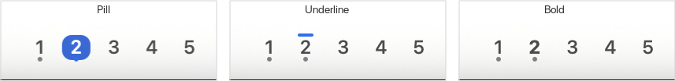

# Yabai Bar

Yabai Bar is a native macOS menu-bar workspace indicator and mouse controller for [yabai](https://github.com/koekeishiya/yabai). It uses one status item for the full workspace group, keeps empty spaces visible by default, and sends focus requests back to yabai.



## Requirements

- macOS 13 or newer
- yabai 7.1.19 or newer
- Xcode 15 or newer with the Swift toolchain

Yabai Bar does not need Accessibility, Screen Recording, or Input Monitoring permission. It does not install the yabai scripting addition or change SIP.

## Install

Download the DMG from the matching GitHub release. Open it, then drag `YabaiBar.app` onto the `Applications` shortcut.

Release builds are ad-hoc signed and are not notarized. On first launch, Control-click `YabaiBar.app` in Applications, choose Open, then confirm Open. If macOS still blocks it, use Open Anyway under System Settings > Privacy & Security. You do not need to disable Gatekeeper or SIP.

### macOS 27 compatibility

SIP-enabled space focusing is broken upstream on macOS 27 through yabai 7.1.25. On that combination, Yabai Bar keeps showing workspace state but makes workspace labels non-interactive. Right-click menus continue to work. A later yabai version automatically restores workspace clicks.

## Build and test

```sh
make test
make app
open dist/YabaiBar.app
```

`make app` creates an ad-hoc signed build for local use. `make dmg` creates the drag-to-Applications disk image. Set `VERSION` when packaging a version other than the one in `Info.plist`:

```sh
VERSION=1.2.3 make dmg
```

Set `CODESIGN_IDENTITY` to a Developer ID Application identity for a signed build:

```sh
CODESIGN_IDENTITY='Developer ID Application: Example (TEAMID)' make app
```

The package builds for the host architecture. Release automation can pass architecture flags or combine per-architecture builds when Intel distribution is required.

For a signed and notarized archive, store notarytool credentials in a keychain profile and run:

```sh
CODESIGN_IDENTITY='Developer ID Application: Example (TEAMID)' \
NOTARY_PROFILE='yabai-bar-notary' \
make release
```

## Configuration

The optional config file lives at `~/.config/yabai-bar/config.json`. Missing keys use defaults.

```json
{
  "activeStyle": "pill",
  "font": "system",
  "launchAtLogin": true,
  "showEmptySpaces": true,
  "showOccupiedIndicators": true,
  "showVisibleSpaces": true,
  "spaceDisplay": "index",
  "spacing": "regular",
  "yabaiPath": "auto"
}
```

Yabai resolution checks an explicit path, `/opt/homebrew/bin/yabai`, `/usr/local/bin/yabai`, then the user's login shell. The app reloads the config when another process changes it.

## Command-line helper

The packaged app includes `Contents/MacOS/yabai-barctl`:

```sh
yabai-barctl event space_changed
yabai-barctl refresh
yabai-barctl status
yabai-barctl status --json
yabai-barctl doctor
```

The app reconciles its own `yabai-bar.*` signals at launch and after yabai or the Dock restarts. It leaves all other signals untouched.

## Release work

Pushing a SemVer tag such as `v1.2.3` or `1.2.3-beta.1` runs the release workflow. It tests the project, builds a universal DMG, verifies both architectures, and publishes the DMG with its SHA-256 checksum. Other tags are ignored.

The automated release is not notarized. The manual release script remains available for Developer ID signing and Apple notarization.
